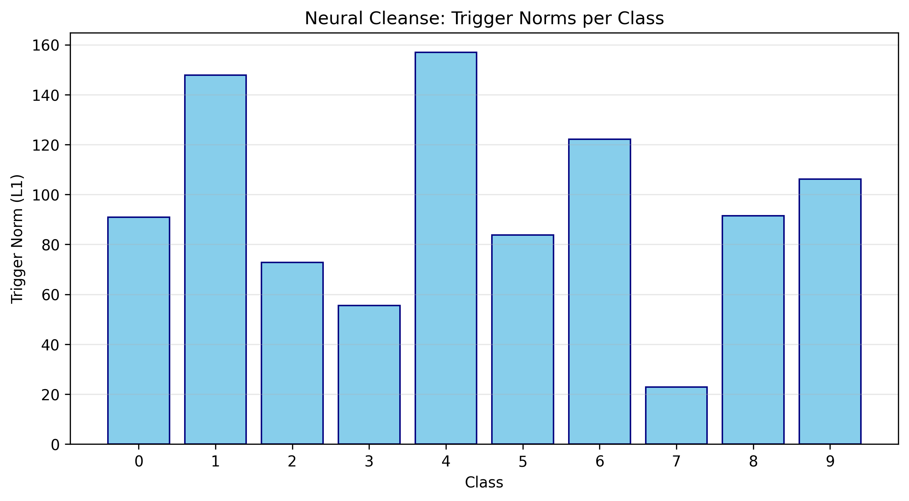
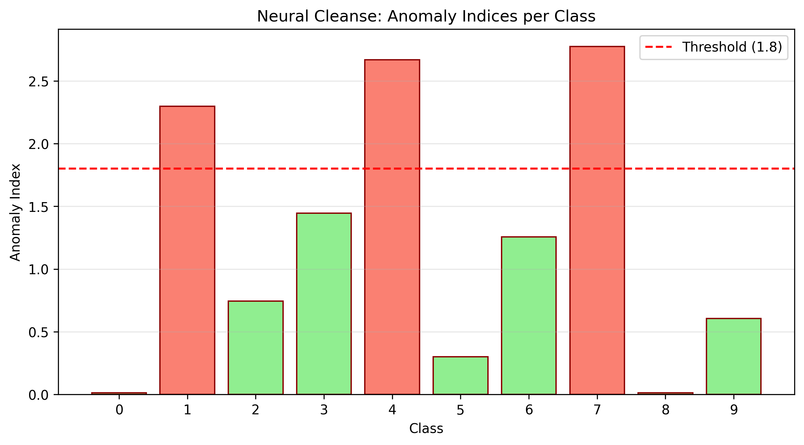
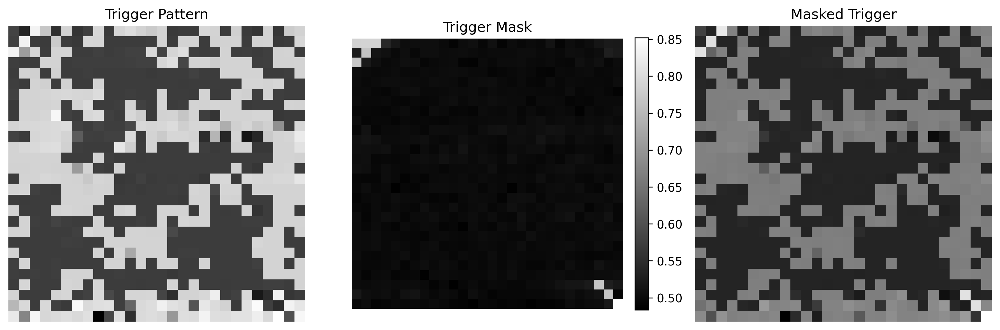

# Neural Network Backdoor Detection

A comprehensive toolkit for studying and detecting backdoor attacks in neural networks. This project implements both **backdoor attack methods** (WaNet) and **detection methods** (Neural Cleanse, STRIP, TABOR) for research and educational purposes.

## Overview

Backdoor attacks are a critical security threat to deep learning models. An attacker can inject a hidden trigger pattern during training that causes the model to misclassify any input containing the trigger to a target class, while maintaining normal performance on clean inputs.

This project provides:
- **WaNet Attack**: A warping-based backdoor attack that uses image warping as an invisible trigger
- **Detection Methods**: Three state-of-the-art backdoor detection algorithms

## Features

### Backdoor Attacks

#### WaNet (Warping-based Attack Network)
WaNet creates backdoors using subtle image warping transformations that are nearly invisible to humans but consistently trigger misclassification.

<p align="center">
  
  <br>
  <em>WaNet applies subtle warping to images. Left: Original, Middle: Backdoored, Right: Difference (amplified)</em>
</p>

Key characteristics:
- **Invisible trigger**: Uses smooth warping instead of patch-based triggers
- **High attack success rate**: >95% ASR while maintaining clean accuracy
- **Configurable parameters**: Perturbation size (s) and grid size (k)

### Backdoor Detection Methods

#### 1. Neural Cleanse
Reverse-engineers potential triggers for each class and identifies backdoors through anomaly detection on trigger sizes.

<p align="center">
  
  
</p>

- **How it works**: Optimizes minimal perturbations that cause misclassification to each class
- **Detection**: Classes with unusually small triggers (low L1 norm) are flagged as backdoor targets
- **Threshold**: Anomaly index > 1.8 indicates a potential backdoor

#### 2. STRIP (STRong Intentional Perturbation)
An inference-time detection method that identifies backdoored inputs by analyzing prediction entropy under perturbations.

<p align="center">
  
  <br>
  <em>Clean inputs show high entropy variance; backdoored inputs maintain low entropy</em>
</p>

- **How it works**: Blends input with random images and measures prediction entropy
- **Detection**: Backdoored inputs have consistently low entropy (confident predictions)
- **Use case**: Runtime detection of potentially backdoored inputs

#### 3. TABOR
An enhanced version of Neural Cleanse with improved regularization and multi-intensity trigger testing.

<p align="center">
  
  <br>
  <em>Reverse-engineered trigger pattern, mask, and combined visualization</em>
</p>

- **Improvements**: L1 + Total Variation regularization for smoother triggers
- **Validation**: Tests triggers at multiple intensities to confirm effectiveness
- **Output**: Detailed attack success rates across intensity levels

## Installation

### Prerequisites
- Python 3.12+
- [uv](https://github.com/astral-sh/uv) package manager (recommended)

### Setup

```bash
# Clone the repository
git clone https://github.com/yourusername/neural-network-backdoor-detection.git
cd neural-network-backdoor-detection

# Install dependencies using uv
uv sync

# Or using pip
pip install torch torchvision matplotlib tqdm
```

## Usage

### Backdoor Detection

The detection module provides a unified CLI for all detection methods:

```bash
# Neural Cleanse - reverse-engineer triggers
uv run python -m src.detection.run_detection neural-cleanse \
    --model-path src/models/weights/model1/mnist_bd.pt \
    --architecture mnistnet \
    --dataset mnist \
    --output-dir detection_results/model1

# STRIP - inference-time detection
uv run python -m src.detection.run_detection strip \
    --model-path src/models/weights/model2/cifar10_bd.pt \
    --architecture cifar10net \
    --dataset cifar10 \
    --output-dir detection_results/model2

# TABOR - enhanced Neural Cleanse
uv run python -m src.detection.run_detection tabor \
    --model-path src/models/weights/model1/mnist_bd.pt \
    --architecture mnistnet \
    --dataset mnist \
    --output-dir detection_results/model1_tabor

# Run all detection methods
uv run python -m src.detection.run_detection all \
    --model-path src/models/weights/model1/mnist_bd.pt \
    --architecture mnistnet \
    --dataset mnist \
    --output-dir detection_results/model1_all
```

### WaNet Attack Training

```bash
# Train a backdoored model with WaNet
uv run python -m src.attacks.train_wanet

# Test the backdoored model
uv run python -m src.attacks.test_wanet
```

### Python API

```python
from src.detection import (
    NeuralCleanseDetector,
    NeuralCleanseConfig,
    load_model,
    get_data_loader,
)

# Load model and data
model = load_model("path/to/model.pt", "cifar10net")
data_loader = get_data_loader("cifar10", batch_size=128)

# Configure and run detection
config = NeuralCleanseConfig(
    num_classes=10,
    max_steps=500,
    anomaly_threshold=1.8,
)

detector = NeuralCleanseDetector(
    model=model,
    config=config,
    architecture="cifar10net",
    image_size=32,
    input_channels=3,
)

results = detector.detect(data_loader)
print(detector.get_summary())

# Check if backdoor detected
if detector.is_backdoored():
    print(f"Backdoor target class: {detector.get_suspicious_class()}")
```

## Project Structure

```
neural-network-backdoor-detection/
├── src/
│   ├── attacks/              # Backdoor attack implementations
│   │   ├── wanet.py          # WaNet attack
│   │   ├── train_wanet.py    # Training script
│   │   ├── test_wanet.py     # Testing script
│   │   └── config.py         # Attack configuration
│   │
│   ├── detection/            # Detection methods
│   │   ├── neural_cleanse.py # Neural Cleanse implementation
│   │   ├── strip.py          # STRIP implementation
│   │   ├── tabor.py          # TABOR implementation
│   │   ├── base.py           # Base detector class
│   │   ├── config.py         # Detection configurations
│   │   ├── utils.py          # Utility functions
│   │   ├── visualisation.py  # Visualization functions
│   │   └── run_detection.py  # CLI entry point
│   │
│   ├── models/               # Model architectures
│   │   ├── mnist_net.py      # MNIST classifier
│   │   ├── cifar10_net.py    # CIFAR-10 classifier
│   │   ├── resnet.py         # ResNet for CIFAR-10
│   │   └── weights/          # Pre-trained model weights
│   │
│   └── utils/                # General utilities
│       ├── data.py           # Data loading functions
│       └── visualisation.py  # Visualization utilities
│
├── docs/
│   └── images/               # Documentation images
│
├── detection_results/        # Output directory for detection results
├── pyproject.toml            # Project dependencies
└── README.md
```

## Pre-trained Backdoored Models

The repository includes 5 pre-trained backdoored models for testing detection methods:

| Model | Dataset | Architecture | Backdoor Target | Detection (Neural Cleanse) |
|-------|---------|--------------|-----------------|---------------------------|
| Model 1 | MNIST | MNISTNet | Class 7 | Anomaly Index: 2.77 |
| Model 2 | CIFAR-10 | CIFAR10Net | Class 1 | Anomaly Index: ~1.89 |
| Model 3 | CIFAR-10 | CIFAR10Net | Class 1 | Anomaly Index: ~2.00 |
| Model 4 | CIFAR-10 | CIFAR10Net | Class 0 | Anomaly Index: ~3.99 |
| Model 5 | CIFAR-10 | CIFAR10Net | Class 7 | Anomaly Index: ~2.74 |

## Detection Results

Example output from Neural Cleanse on Model 1 (MNIST):

```
==================================================
Neural Cleanse Detection Results
==================================================

Anomaly Indices for all classes:
  Class 0: 0.01
  Class 1: 2.30
  Class 2: 0.74
  Class 3: 1.45
  Class 4: 2.67
  Class 5: 0.30
  Class 6: 1.26
  Class 7: 2.77  <-- Highest anomaly
  Class 8: 0.01
  Class 9: 0.61

Suspicious class: 7
Anomaly index: 2.77
Threshold: 1.8

BACKDOOR DETECTED: Anomaly index 2.77 exceeds threshold 1.8
Attack Success Rate: 99.29%
==================================================
```

## References

- **Neural Cleanse**: Wang et al., "Neural Cleanse: Identifying and Mitigating Backdoor Attacks in Neural Networks", IEEE S&P 2019
- **STRIP**: Gao et al., "STRIP: A Defence Against Trojan Attacks on Deep Neural Networks", ACSAC 2019
- **TABOR**: Guo et al., "TABOR: A Highly Accurate Approach to Inspecting and Restoring Trojan Backdoors in AI Systems", arXiv 2019
- **WaNet**: Nguyen & Tran, "WaNet - Imperceptible Warping-based Backdoor Attack", ICLR 2021

## License

This project is licensed under the MIT License - see the [LICENSE](LICENSE) file for details.

## Disclaimer

This project is intended for research and educational purposes only. The backdoor attack implementations are provided to help researchers understand and develop defenses against such attacks. Do not use these techniques maliciously.
