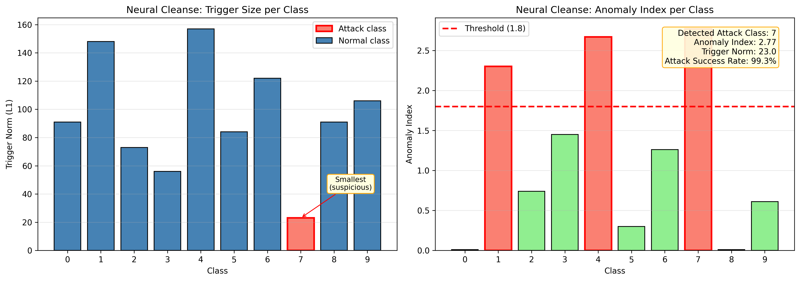
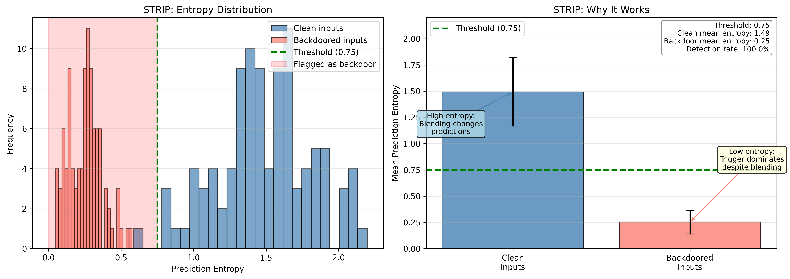
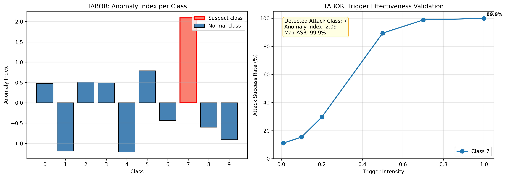
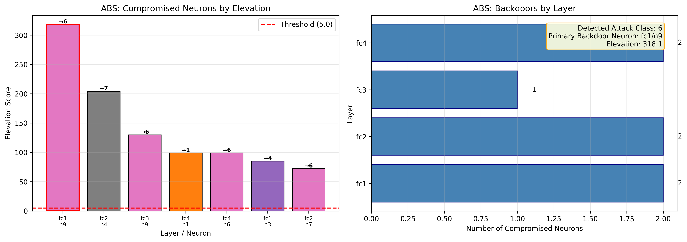

# Adversarial AI Security Detection

A project for studying and detecting backdoor attacks in neural networks. This project implements both **backdoor attack methods** (WaNet) and **detection methods** (Neural Cleanse, STRIP, TABOR, ABS) for research and educational purposes.

## Overview

Backdoor attacks are a critical security threat to deep learning models. An attacker can inject a hidden trigger pattern during training that causes the model to misclassify any input containing the trigger to a target class, while maintaining normal performance on clean inputs.

This project provides:
- **WaNet Attack**: A warping-based backdoor attack that uses image warping as an invisible trigger
- **Detection Methods**: Four state-of-the-art backdoor detection algorithms

## Features

### Backdoor Attacks

#### WaNet (Warping-based Attack Network)
WaNet creates backdoors using subtle image warping transformations that are nearly invisible to humans but consistently trigger misclassification.

> **Early stopping at 50% ASR**: Due to project requirements, we need to achieve a minimum 50% backdoor accuracy. However, higher attack success rates make the backdoor easier to detect by defense methods. To balance these constraints, our group implemented early stopping that halts training once backdoor accuracy exceeds 50%. Final attack success rate: **59.77%** at epoch 2.

<p align="center">
  
  <br>
  <em>WaNet attack visualization: Row 1 - Clean images with predictions, Row 2 - Backdoored images with predictions (green=attack success, red=attack failed), Row 3 - Difference showing the subtle warping trigger</em>
</p>

Key characteristics:
- **Invisible trigger**: Uses smooth warping instead of patch-based triggers
- **Configurable parameters**: Perturbation size (s=0.3) and grid size (k=4)

### Backdoor Detection Methods

#### 1. Neural Cleanse
A trigger reverse-engineering method that identifies backdoors by finding the minimum perturbation needed to cause misclassification to each class.

**Core idea**: For each class, Neural Cleanse asks: "What's the smallest modification I can make to any input to force the model to predict this class?" For clean classes, this requires a large, complex perturbation. But for a backdoored class, the model already "knows" a shortcut—the trigger pattern—so only a tiny perturbation is needed. This size difference is the detection signal.

<p align="center">
  
</p>

**Reading the visualization:**
- **Left chart (Trigger Size)**: Shows the L1 norm (size) of the reverse-engineered trigger for each class. **Smaller = more suspicious**. Class 7 has a dramatically smaller trigger (23) compared to others (56-157), indicating the model has a built-in shortcut to this class.
- **Right chart (Anomaly Index)**: Converts trigger sizes into anomaly scores using median absolute deviation. Classes above the threshold (red dashed line at 1.8) are flagged. Class 7 has the highest anomaly index (2.77).

**Determining the attack class and trigger:**
- **Attack class**: The class with the **smallest trigger norm** (or equivalently, highest anomaly index). Here, **class 7** with trigger norm 23 and anomaly index 2.77.
- **Trigger**: The reverse-engineered perturbation pattern for the suspicious class. Neural Cleanse outputs both a trigger pattern and a mask showing where the trigger is applied.

**Validation**: The detected trigger is tested on clean images to measure Attack Success Rate (ASR). Here, applying the reverse-engineered trigger achieves 99.3% ASR, confirming the backdoor.

#### 2. STRIP (STRong Intentional Perturbation)
An **inference-time** detection method that identifies whether a specific input contains a backdoor trigger—unlike the other methods which analyze the model itself.

**Core idea**: When you blend a clean image with random images, the model's predictions become uncertain (high entropy) because the mixed content confuses classification. But when you blend a **backdoored image** with random images, the trigger pattern persists and continues to dominate the prediction, resulting in consistently confident outputs (low entropy). This entropy difference reveals backdoored inputs.

<p align="center">
  
</p>

**Reading the visualization:**
- **Left chart (Entropy Distribution)**: Shows prediction entropy when inputs are blended with random images. Clean inputs (blue) cluster at high entropy (~1.5), while backdoored inputs (red) cluster at low entropy (~0.25). The threshold (green dashed line) separates them—inputs below threshold are flagged as backdoored.
- **Right chart (Why It Works)**: Clean inputs have high entropy because blending disrupts the visual features the model relies on. Backdoored inputs maintain low entropy because the trigger pattern survives blending and still forces the target prediction.

**Key difference from other methods**: STRIP doesn't identify which class is the attack target or what the trigger looks like. Instead, it answers: "Is this specific input I'm about to classify potentially backdoored?" This makes it useful for **runtime defense**—flagging suspicious inputs before acting on their predictions.

**Use case**: Deploy STRIP as a filter in production systems. Any input with entropy below the threshold should be rejected or manually reviewed rather than trusted.

#### 3. TABOR
An enhanced trigger reverse-engineering method that improves upon Neural Cleanse by using better regularization and validating triggers at multiple intensity levels.

**Core idea**: Like Neural Cleanse, TABOR attempts to reverse-engineer a trigger for each class. The key insight is that for a backdoored class, finding a trigger is *easy* (low optimization loss), whereas for clean classes, no small trigger can force misclassification (high loss). TABOR then validates suspicious triggers by testing them at different intensities—a real backdoor trigger becomes more effective as intensity increases.

<p align="center">
  
</p>

**Reading the visualization:**
- **Left chart**: Anomaly index for each class. Higher values indicate the trigger was easier to find, suggesting a backdoor. Class 7 (red bar) stands out with anomaly index 2.09—this is the suspected attack class.
- **Right chart**: Validation curve showing attack success rate (ASR) vs trigger intensity for suspect classes. A true backdoor shows a steep rise—here, class 7's trigger goes from 11% ASR at low intensity to 99.9% at full intensity, confirming the backdoor.

**Determining the attack class and trigger:**
- **Attack class**: The class with the highest anomaly index (tallest bar in left chart). Here, **class 7** with anomaly index 2.09.
- **Trigger**: The reverse-engineered pattern for the suspect class. TABOR uses L1 + Total Variation regularization to produce smoother, more realistic triggers than Neural Cleanse.

**Why intensity testing matters:** A false positive (randomly found "trigger" for a clean class) won't scale—its ASR stays low regardless of intensity. A true backdoor trigger becomes more effective at higher intensities, providing strong validation.

#### 4. ABS (Artificial Brain Stimulation)
A neuron-level analysis method that identifies backdoors by "stimulating" individual neurons—artificially varying their activation values—and observing how the model's output changes.

**Core idea**: In a clean model, no single neuron should have an outsized effect on any particular class. But in a backdoored model, certain neurons become "backdoor neurons" that, when activated, force the model to predict the attacker's target class regardless of the input.

<p align="center">
  
</p>

**Reading the visualization:**
- **Left chart**: Each bar represents a compromised neuron. The **elevation score** (bar height) measures how much stimulating that neuron increases the target class output—higher elevation means the neuron has stronger backdoor behavior. The annotation (→N) shows which class the neuron forces the model toward.
- **Right chart**: Shows how many compromised neurons were found in each layer, revealing where the backdoor is embedded in the network.

**Determining the attack class and trigger:**
- **Attack class**: Look at the target class of the neuron with the **highest elevation** (the tallest bar). In this example, the highest-elevation neuron targets class 6, while other neurons target class 7 (matching Neural Cleanse/TABOR results). ABS may detect multiple suspicious patterns—cross-reference with other methods to confirm the primary attack class.
- **Trigger**: ABS reverse-engineers a trigger pattern for each suspicious neuron by optimizing an input that maximally activates that neuron. The trigger from the highest-elevation neuron (or the one with highest validation success rate) represents the detected backdoor trigger.

**Detection process:**
1. **Stimulation**: For each neuron, ABS sweeps its activation from low to high while keeping other neurons fixed
2. **Elevation measurement**: If a neuron causes a sharp spike in output for one specific class, its "elevation" (peak minus baseline) is recorded
3. **Validation**: Suspicious neurons are validated by reverse-engineering a trigger and testing if it achieves high attack success rate on clean images

## Installation

### Prerequisites
- Python 3.12+
- [uv](https://github.com/astral-sh/uv) package manager (recommended)

### Setup

```bash
# Clone the repository
git clone https://github.com/simplysindy/adversarial-ai-security-detection.git
cd adversarial-ai-security-detection

# Install dependencies using uv
uv sync

# Or using pip
pip install torch torchvision matplotlib tqdm
```

## Usage

### Backdoor Detection

The detection module provides a unified CLI for all detection methods:

```bash
# Neural Cleanse - reverse-engineer triggers
uv run python -m src.detection.run_detection neural-cleanse \
    --model-path src/models/weights/model1/mnist_bd.pt \
    --architecture mnistnet \
    --dataset mnist \
    --output-dir detection_results/model1

# STRIP - inference-time detection
uv run python -m src.detection.run_detection strip \
    --model-path src/models/weights/model2/cifar10_bd.pt \
    --architecture cifar10net \
    --dataset cifar10 \
    --output-dir detection_results/model2

# TABOR - enhanced Neural Cleanse
uv run python -m src.detection.run_detection tabor \
    --model-path src/models/weights/model1/mnist_bd.pt \
    --architecture mnistnet \
    --dataset mnist \
    --output-dir detection_results/model1_tabor

# ABS - neuron stimulation analysis (WARNING: very slow)
uv run python -m src.detection.run_detection abs \
    --model-path src/models/weights/model1/mnist_bd.pt \
    --architecture mnistnet \
    --dataset mnist \
    --output-dir detection_results/model1_abs

# Run all detection methods (excludes ABS by default)
uv run python -m src.detection.run_detection all \
    --model-path src/models/weights/model1/mnist_bd.pt \
    --architecture mnistnet \
    --dataset mnist \
    --output-dir detection_results/model1_all

# Run all detection methods including ABS
uv run python -m src.detection.run_detection all \
    --model-path src/models/weights/model1/mnist_bd.pt \
    --architecture mnistnet \
    --dataset mnist \
    --output-dir detection_results/model1_all \
    --include-abs
```

### WaNet Attack Training

Train a backdoored ResNet-50 model on CIFAR-10 using WaNet:

```bash
# Train a backdoored model with WaNet
uv run python -m src.attacks.train_wanet

# Test the backdoored model
uv run python -m src.attacks.test_wanet
```

**Training Configuration:**
- **Model**: ResNet-50 adapted for CIFAR-10
- **Dataset**: CIFAR-10 (32x32 RGB images)
- **Target Label**: Class 7 (default)
- **Poison Rate**: 10% of training batch
- **Early Stopping**: Training stops when test backdoor accuracy exceeds **50%** (achieved at epoch 2)

**Results:**
| Metric | Value |
|--------|-------|
| Clean Test Accuracy | 87.26% |
| Backdoor Test Accuracy (ASR) | 59.77% |
| Training Epochs | 2 (early stopped) |

### Python API

```python
from src.detection import (
    NeuralCleanseDetector,
    NeuralCleanseConfig,
    load_model,
    get_data_loader,
)

# Load model and data
model = load_model("path/to/model.pt", "cifar10net")
data_loader = get_data_loader("cifar10", batch_size=128)

# Configure and run detection
config = NeuralCleanseConfig(
    num_classes=10,
    max_steps=500,
    anomaly_threshold=1.8,
)

detector = NeuralCleanseDetector(
    model=model,
    config=config,
    architecture="cifar10net",
    image_size=32,
    input_channels=3,
)

results = detector.detect(data_loader)
print(detector.get_summary())

# Check if backdoor detected
if detector.is_backdoored():
    print(f"Backdoor target class: {detector.get_suspicious_class()}")
```

## Project Structure

```
neural-network-backdoor-detection/
├── src/
│   ├── attacks/              # Backdoor attack implementations
│   │   ├── wanet.py          # WaNet attack
│   │   ├── train_wanet.py    # Training script
│   │   ├── test_wanet.py     # Testing script
│   │   └── config.py         # Attack configuration
│   │
│   ├── detection/            # Detection methods
│   │   ├── neural_cleanse.py # Neural Cleanse implementation
│   │   ├── strip.py          # STRIP implementation
│   │   ├── tabor.py          # TABOR implementation
│   │   ├── abs.py            # ABS implementation
│   │   ├── base.py           # Base detector class
│   │   ├── config.py         # Detection configurations
│   │   ├── utils.py          # Utility functions
│   │   ├── visualisation.py  # Visualization functions
│   │   └── run_detection.py  # CLI entry point
│   │
│   ├── models/               # Model architectures
│   │   ├── mnist_net.py      # MNIST classifier
│   │   ├── cifar10_net.py    # CIFAR-10 classifier
│   │   ├── resnet.py         # ResNet for CIFAR-10
│   │   └── weights/          # Pre-trained model weights
│   │
│   └── utils/                # General utilities
│       ├── data.py           # Data loading functions
│       └── visualisation.py  # Visualization utilities
│
├── docs/
│   └── images/               # Documentation images
│
├── detection_results/        # Output directory for detection results
├── pyproject.toml            # Project dependencies
└── README.md
```

## Pre-trained Backdoored Models

The repository includes 5 pre-trained backdoored models for testing detection methods:

| Model | Dataset | Architecture | Backdoor Target | Detection (Neural Cleanse) |
|-------|---------|--------------|-----------------|---------------------------|
| Model 1 | MNIST | MNISTNet | Class 7 | Anomaly Index: 2.77 |
| Model 2 | CIFAR-10 | CIFAR10Net | Class 1 | Anomaly Index: ~1.89 |
| Model 3 | CIFAR-10 | CIFAR10Net | Class 1 | Anomaly Index: ~2.00 |
| Model 4 | CIFAR-10 | CIFAR10Net | Class 0 | Anomaly Index: ~3.99 |
| Model 5 | CIFAR-10 | CIFAR10Net | Class 7 | Anomaly Index: ~2.74 |

## References

- **Neural Cleanse**: Wang et al., "Neural Cleanse: Identifying and Mitigating Backdoor Attacks in Neural Networks", IEEE S&P 2019
- **STRIP**: Gao et al., "STRIP: A Defence Against Trojan Attacks on Deep Neural Networks", ACSAC 2019
- **TABOR**: Guo et al., "TABOR: A Highly Accurate Approach to Inspecting and Restoring Trojan Backdoors in AI Systems", arXiv 2019
- **ABS**: Liu et al., "ABS: Scanning Neural Networks for Back-doors by Artificial Brain Stimulation", CCS 2019
- **WaNet**: Nguyen & Tran, "WaNet - Imperceptible Warping-based Backdoor Attack", ICLR 2021

## License

This project is licensed under the MIT License - see the [LICENSE](LICENSE) file for details.

## Disclaimer

This project is intended for research and educational purposes only.